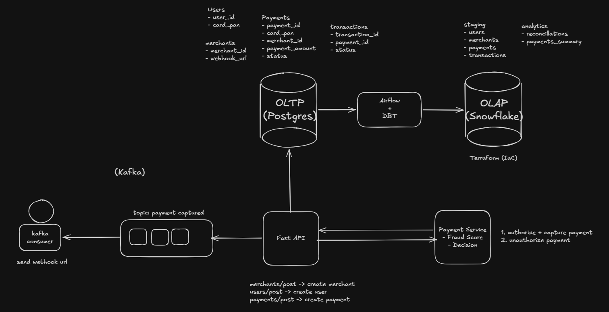
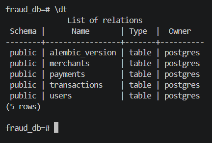
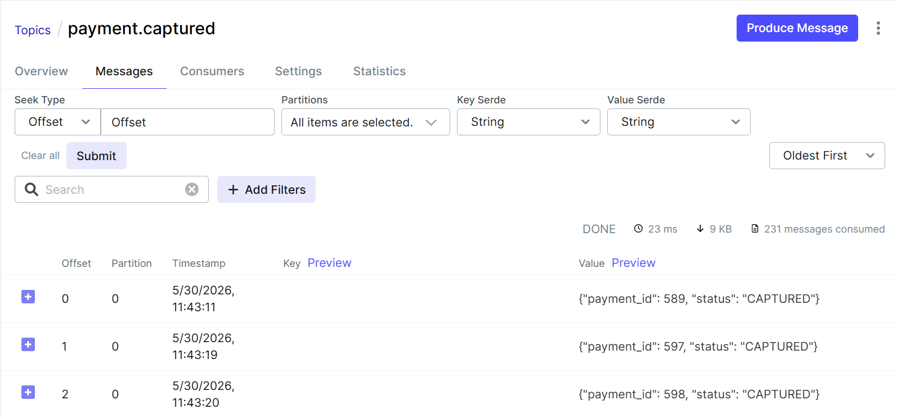
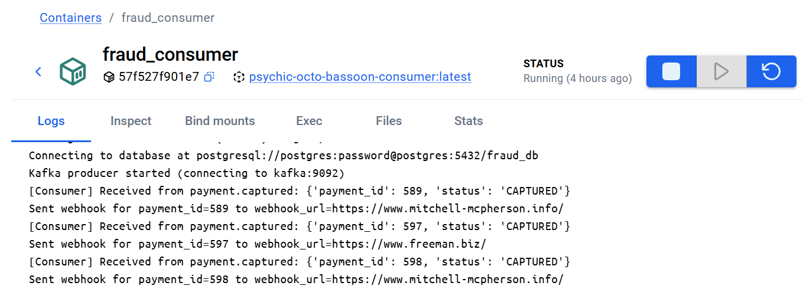
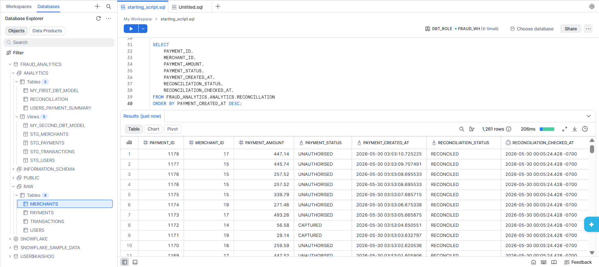
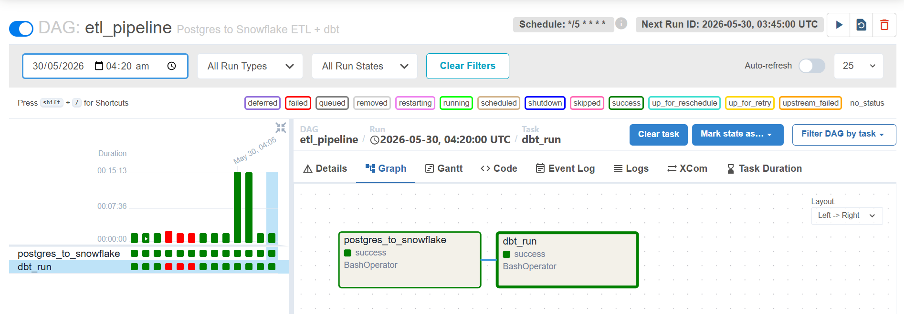

# Event-Driven Payments Analytics Platform


A portfolio project demonstrating how a payments platform evolves from a simple transactional API into a fully observable, analytics-ready data system — each layer introduced deliberately as the previous one reaches its operational limits.

---

## Architecture Overview



---
 
## The Layered Maturity Model

The system is built in four progressive layers. Each one is not added for completeness — it is added because the previous state created a concrete gap worth closing.

---

### Level 1 — Application Core: FastAPI + PostgreSQL + Alembic

**At this stage**, the system is a working payments API. Merchants register, users attach cards, and payments are created and evaluated. The entire operational footprint lives in a single database, and the schema is simple enough to reason about directly.

**What's here:**
- A **FastAPI** application exposing three core endpoints:
  - `POST /merchants` — register a merchant with a webhook URL
  - `POST /users` — create a user with a card on file
  - `POST /payments` — initiate a payment, triggering fraud evaluation
- A **Payment Service** (co-located in the same FastAPI app) implementing a rule-based fraud detection engine. If a payment amount exceeds a configured threshold, it is declined. Otherwise it is authorised and captured. This simulates the decision layer a real fraud engine would occupy.
- **PostgreSQL** as the OLTP database, with schema migrations managed by **Alembic** — ensuring the database schema is version-controlled and applied consistently across environments.

**Core tables:**

| Table | Key Columns |
|---|---|
| `users` | `user_id`, `card_pan` |
| `merchants` | `merchant_id`, `webhook_url` |
| `payments` | `payment_id`, `card_pan`, `merchant_id`, `payment_amount`, `status` |
| `transactions` | `transaction_id`, `payment_id`, `status` |

`payments` is the source of truth for a payment's current state. `transactions` is an append-only ledger — a new row is written when a payment is created and again when it is captured, giving a timestamped record of every state transition. In this project, authorisation and capture happen in immediate succession to keep the flow simple.

**Why Postgres:** The right default for transactional workloads — ACID guarantees, strong consistency, and a mature ecosystem. The schema maps cleanly to relational semantics. Running analytics directly on this database works at small scale, but becomes a liability as volume grows (addressed in Level 3).

**Why Alembic:** Schema changes without a migration tool are fragile — applied inconsistently across environments, difficult to roll back, and invisible to version control. Alembic makes every schema change an explicit, trackable operation.


*Postgres tables after Alembic migrations run*

---

### Level 2 — Event-Driven Webhooks: Kafka

**At this stage**, the system needs to notify merchants when a payment is captured. A synchronous call to the merchant's `webhook_url` from inside the API works, but creates tight coupling: if the merchant's server is slow or down, the API request hangs. There is no retry logic, no delivery audit trail, and webhook throughput is bounded by API response time.

**What's here:**
- After the Payment Service authorises and captures a payment, the API publishes an event to a **Kafka topic** (`payment_captured`).
- A **consumer service** subscribes to this topic and is solely responsible for delivering the webhook to the merchant's registered URL. It runs as a separate process, independently of the API.
- The API returns immediately after publishing. Delivery is fully decoupled.
- Kafka runs in **KRaft mode** (no Zookeeper) using the official `apache/kafka` image — a simpler, more modern deployment with the controller and broker co-located in a single node for this project's scale.
- A **Kafka UI** is included for observability into topics, consumer group offsets, and message payloads during development.

**The flow:**

```
POST /payments
  → Payment Service: evaluate fraud → authorise + capture
  → API: publish to Kafka topic `payment_captured`
  → Consumer: read event → POST to merchant webhook_url
```

**Why Kafka:** Payment platforms widely adopt event-driven architectures to separate transactional processing from asynchronous downstream workflows — and Kafka is the industry-standard tool for that pattern. It provides a durable, ordered, replayable event log: if the consumer is down, events are not lost; they wait. This durability and the clean separation of producer and consumer responsibilities is exactly what webhook delivery requires.


*Kafka UI — `payment_captured` topic with captured payment events*


*Consumer group offsets confirming delivery progress*

---

### Level 3 — Analytical Layer: DBT + Snowflake

**At this stage**, the operational database is doing double duty. Postgres handles live transactional traffic well, but analytical queries — reconciliations, payment summaries, aggregations across large time windows — add pressure to the same database serving the live API. The two concerns need to be separated, and the analytical layer needs its own data model, purpose-built for reads.

**What's here:**
- A **`postgres_to_snowflake` script** handles the only cross-boundary step: extracting the four Postgres tables and loading them as-is into Snowflake's `raw` schema. This is the sole point where data leaves the operational database.
- **Snowflake** serves as the OLAP data warehouse. From the `raw` schema inward, everything is contained within Snowflake across two layers:
  - **Staging:** DBT views that mirror the `raw` tables — a clean, typed representation of the source data before any transformation
  - **Analytics:** DBT models built on top of staging:
    - `reconciliations` — joins payments against transactions to verify that every captured payment has a matching transaction record, surfacing mismatches as a reliability signal for the payment system
    - `payments_summary` — aggregates per-user payment activity: total payments made and the proportion of authorised vs declined, giving a behavioural view across the user base
- **DBT** (project: `dbt_fraud`) operates entirely within Snowflake — it never reads from Postgres. It defines the staging-to-analytics transformation layer as versioned SQL models, with lineage tracking and documentation generation built in.

**Why Snowflake:** Snowflake separates compute from storage, scales analytical query concurrency without manual tuning, and integrates cleanly with the rest of the modern data stack. It is the natural destination for this kind of EL+T pipeline.

**Why DBT over raw SQL scripts:** DBT enforces structure — models are composable, transformations are version-controlled, and column-level lineage is available for free. It also makes the analytical layer testable, which ad-hoc SQL scripts are not.


*Snowflake staging (raw) and analytics tables*

---

### Level 4 — Orchestration & Infrastructure: Airflow + Terraform

**At this stage**, the ETL pipeline from Postgres to Snowflake needs to run reliably on a schedule, in the correct order, with retries on failure and visibility into what ran and when. Running it manually is not sustainable. Similarly, provisioning Snowflake infrastructure by hand is not repeatable — it breaks down the moment someone else tries to replicate the environment, or when the infrastructure needs to be torn down and rebuilt.

**What's here:**
- **Apache Airflow** orchestrates the full pipeline as a DAG (`payments_etl`):
  1. **Extract & Load** — `postgres_to_snowflake` script copies the four Postgres tables into Snowflake's `raw` schema
  2. **Transform** — `dbt run` builds staging views on top of `raw`, then promotes to analytics models (`reconciliations`, `payments_summary`)
- Airflow uses **LocalExecutor** backed by its own dedicated Postgres metadata database, keeping it isolated from the application database.
- **Terraform** provisions the Snowflake infrastructure (roles, databases, schemas, warehouses) as code — declarative, version-controlled, and reproducible. Key-pair authentication is assumed to be configured on the Snowflake side (see [Snowflake key-pair authentication docs](https://docs.snowflake.com/en/user-guide/key-pair-auth) for setup); Terraform handles role and resource creation from that point.

**Why Airflow:** Airflow gives you a dependency graph between tasks, a UI for monitoring runs, configurable retries, and alerting on failure. For a two-step pipeline this may feel like overhead, but it mirrors the tool you would reach for in a production data platform, and the observability it provides is immediately visible in a portfolio context.

**Why Terraform:** Infrastructure provisioning should be reproducible. Terraform's declarative syntax means the Snowflake environment is fully described in code — no manual steps, no configuration drift, and straightforward replication for anyone running this project.


*Airflow DAG showing ETL → DBT task dependency and run history*

---

## Tech Stack Reference

| Tool | Layer | Role | Notes |
|---|---|---|---|
| FastAPI | App | REST API + Payment Service | Async, lightweight, well-suited for microservice-style separation |
| PostgreSQL | App | OLTP database | Transactional store; not designed for analytical workloads |
| Alembic | App | Schema migrations | Version-controlled, reversible schema changes |
| Kafka (KRaft) | Events | Payment event bus | Decouples payment capture from webhook delivery |
| Consumer service | Events | Webhook dispatcher | Isolated process; retries independently of the API |
| Kafka UI | Events | Broker observability | Topic inspection and consumer offset monitoring |
| Snowflake | Analytics | OLAP data warehouse | Columnar, scalable, separates analytical load from OLTP |
| `postgres_to_snowflake` script | Analytics | Postgres → Snowflake EL | Sole cross-boundary step; loads raw tables into Snowflake `raw` schema |
| DBT (`dbt_fraud`) | Analytics | SQL transformation layer | Operates entirely within Snowflake; staging views → analytics models |
| Airflow | Orchestration | Pipeline scheduler | Runs Postgres → Snowflake ETL then `dbt run` as a DAG |
| Terraform | Infrastructure | IaC for Snowflake | Provisions roles, warehouse, databases, schemas |

---

## Data Flow Summary

```
Client
  └─► POST /payments  (FastAPI)
        └─► Payment Service  (rule-based fraud check: amount > threshold?)
              ├─► Authorised  → write payment + transaction to Postgres
              │                 → publish `payment_captured` to Kafka
              │                       └─► Consumer → POST webhook to merchant
              └─► Declined    → write declined status to Postgres

Airflow DAG  (scheduled)
  └─► postgres_to_snowflake script → load raw tables into Snowflake `raw` schema
        └─► dbt run (entirely within Snowflake)
              └─► staging views (mirror `raw`) → analytics models (reconciliations, payments_summary)
```

---

## Design Tradeoffs & Future Improvements

**Shared application image:** The API and Kafka consumer currently share a single Docker image for simplicity. As the services evolve independently, separating them into dedicated images would improve deployment flexibility and dependency isolation.

**Rule-based fraud simulation:** Fraud detection is intentionally implemented as a simple rule-based decision layer to simulate payment authorization workflows. A production system would likely replace this with a dedicated model-serving or risk-scoring service.

**LocalExecutor in Airflow:** Using LocalExecutor with a single scheduler is appropriate for this project's scale. For higher task volume or parallelism, migrating to CeleryExecutor or Kubernetes-based execution would be the path forward.

**Single-broker Kafka deployment:** Kafka runs as a single broker with minimal replication settings for local development simplicity. Production event streaming systems would typically use multi-broker deployments with replication for higher durability and fault tolerance.

**Snowflake provisioning scope:** Terraform here provisions roles, warehouse, databases, and schemas. It assumes key-pair authentication is already configured externally. A more complete IaC setup would manage Snowflake users and network policies as well.

**Webhook failure handling:** Failed webhook deliveries currently have no dead-letter handling or retry queue. A production-oriented event pipeline would likely introduce a dead-letter topic to isolate undeliverable events for later replay or investigation.

---

## Setup Guide

> **Note:** This guide is for running the project locally. If you are reading to understand the architecture, the sections above are self-contained — you can stop here.

### Prerequisites

- Docker and Docker Compose
- Terraform CLI ([install guide](https://developer.hashicorp.com/terraform/install))
- A Snowflake account with key-pair authentication configured ([Snowflake docs](https://docs.snowflake.com/en/user-guide/key-pair-auth)) — Terraform will create roles and resources from there
- Python 3.11+ (only needed if running DBT or Alembic outside Docker)

### Environment Configuration

```bash
cp .env.example .env
```

Fill in the required values — Postgres credentials, Snowflake connection details (account, user, private key path), and the fraud threshold:

```env
# Postgres
POSTGRES_USER=postgres
POSTGRES_PASSWORD=password
POSTGRES_DB=fraud_db

# Snowflake
SNOWFLAKE_USER=snowflake_user
SNOWFLAKE_PK_PATH=path-to-your-private-key.p8
SNOWFLAKE_PK_PASSPHRASE=password-when-generating-key
SNOWFLAKE_ACCOUNT=accont-identifier
SNOWFLAKE_ROLE=snowflake_role

SNOWFLAKE_WAREHOUSE=fraud_wh
SNOWFLAKE_DATABASE=fraud_analytics
SNOWFLAKE_SCHEMA=raw
```

`SNOWFLAKE_SCHEMA=raw` refers to the staging schema — this is the target for the Postgres-to-Snowflake migration script. The analytics schema (views, `reconciliations`, `payments_summary`) is created and managed entirely by DBT and does not need to be configured here.

### Infrastructure Provisioning (Snowflake via Terraform)

Assumes key-pair authentication is already set up on your Snowflake account. Run once before starting the stack:

```bash
cd terraform/
terraform init
terraform plan
terraform apply
```

This creates the Snowflake warehouse, database, staging and analytics schemas, and the required roles.

### Applying Database Migrations

Schema migrations are explicit and run during development — they are not automated on container start. Once the core stack is up, apply the latest migrations with:

```bash
docker-compose exec app alembic upgrade head
```

This runs inside the `app` container against the `fraud_postgres` database. Any new migration files in `alembic/versions/` will be applied in order.

### Starting the Core Stack

Starts Postgres, Kafka, Kafka UI, and the FastAPI app:

```bash
docker-compose up -d
```

Services and ports:
| Service | Port |
|---|---|
| FastAPI app | `localhost:8000` |
| Kafka | `localhost:9092` |
| Kafka UI | `localhost:8080` |
| Postgres (app) | `localhost:5433` |

### Initialising Airflow (first run only)

Initialises the Airflow metadata database and creates the admin user:

```bash
docker-compose --profile reset up airflow-init
```

Run this once. It exits on completion.

### Starting the Full Simulate Stack

Starts the Kafka consumer, simulate script (creates merchants, users, payments, and fires Kafka events), Airflow webserver, and Airflow scheduler:

```bash
docker-compose --profile simulate up -d
```

Additional services and ports:
| Service | Port |
|---|---|
| Airflow UI | `localhost:8081` |
| Airflow Postgres (metadata) | `localhost:5434` |

The simulate script seeds the system end-to-end: it uses the **Faker** library to generate randomised merchants, users, and payment amounts across a configured range. Because payment amounts are random, some will naturally exceed the fraud threshold and be declined — making authorised and declined outcomes non-deterministic across runs. The Airflow DAG (`payments_etl`) can then be triggered from the UI to run the Postgres → Snowflake → DBT pipeline.

---

## Project Structure

```
event-driven-payment-analytics-platform/
├── app/                        # FastAPI application + Payment Service
├── scripts/
│   ├── run_consumer.py         # Kafka consumer entry point
│   ├── postgres_to_snowflake.py    # Raw Postgres mirrors to Snowflake
│   └── simulate.py             # End-to-end simulation script
├── alembic/                    # Schema migration files
├── dbt_fraud/                  # DBT project
│   └── models/
│       ├── staging/            # DBT views mirroring Snowflake raw schema
│       └── analytics/          # reconciliations, payments_summary
├── airflow/
│   └── dags/                   # Airflow DAG definitions
├── terraform/                  # Snowflake infrastructure (IaC)
├── docs/
│   └── screenshots/            # Level-by-level screenshots
├── Dockerfile                  # Shared image for app + consumer
├── Dockerfile.airflow          # Airflow image
├── docker-compose.yml
├── requirements.txt
├── requirements-airflow.txt
└── .env.example
```

---

## What This Project Demonstrates

- Designing a payments system with clean separation between transactional and analytical concerns
- Event-driven architecture using Kafka for reliable, decoupled webhook delivery
- A production-pattern EL+T pipeline: raw extraction → typed staging → business-logic analytics models in DBT
- Schema version control with Alembic alongside the application lifecycle
- Infrastructure as code and pipeline orchestration as first-class engineering concerns, not afterthoughts
- Progressive system design: each tool earns its place by addressing a concrete limitation of the previous state